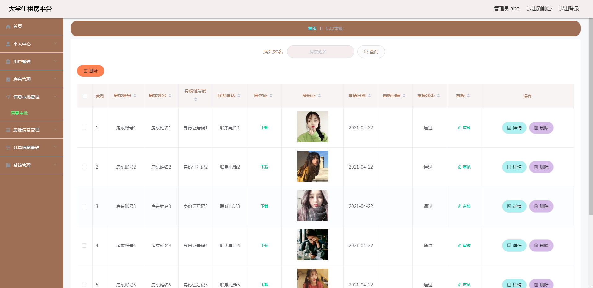
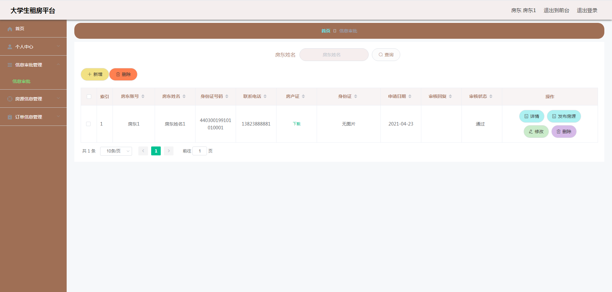

**项目简介：**  
本项目基于主流的前后端分离架构，采用 **SpringBoot + Vue 技术栈**，配套 **MySQL 数据库**，适用于毕业设计与课题实训开发。  
本人已整理了超 **4000 多套毕业设计源码+论文+开题报告+PPT...**，涵盖 **Java、SpringBoot、Vue、SSM、uni-app 小程序、PHP、Android** 等方向，支持功能修改定制与论文服务。  
**团队提供以下服务：**  
- 项目代码修改与调试  
- 数据库配置与远程协助  
- 论文定制与修改  
**获取更多的4000多套源码或SQL文件请联系：**  
- QQ：3906443360 微信：BesheHelp

## springboot007大学生租房平台的设计与实现

**项目简介：**  
本项目基于主流的前后端分离架构，采用 **SpringBoot + Vue 技术栈**，配套 **MySQL 数据库**，适用于毕业设计与课题实训开发。  
本人已整理了超 **4000 多套毕业设计源码+论文+开题报告+PPT...**，涵盖 **Java、SpringBoot、Vue、SSM、uni-app 小程序、PHP、Android** 等方向，支持功能修改定制与论文服务。  
**团队提供以下服务：**  
- 项目代码修改与调试  
- 数据库配置与远程协助  
- 论文定制与修改  
**获取更多的4000多套源码或SQL文件请联系：**  
- QQ：3906443360 微信：BesheHelp**

# 系统实现与系统测试

# 第5章 系统实现

进入到这个环节，也就可以及时检查出前面设计的需求是否可靠了。一个设计良好的方案在运用于系统实现中，是会帮助系统编制人员节省时间，并提升开发效率的。所以在系统的编程阶段，也就是系统实现阶段，对于一些不合理的设计需求，也是可以及时发现。因为设计的方案是完全指导系统的编码过程的。

5.1 管理员功能实现

5.1.1 房东管理

管理员进入指定功能操作区之后可以管理房东。其页面见下图。房东的资料需要管理员负责管理，包括修改，新增，删除等操作。

图5.1 房东管理页面

5.1.2 信息审批管理

管理员进入指定功能操作区之后可以管理信息审批信息。其页面见下图。房东上传房产证和身份证信息，管理员查看后进行审批，审批通过之后，房东才可以发布房源信息。

图5.2 信息审批管理页面

5.1.3 房源信息管理

管理员进入指定功能操作区之后可以管理房源信息。其页面见下图。房东发布的房源信息需要先通过管理员的审核，然后才能展示在前台进行出租。

图5.3 房源信息管理页面

5.2 房东功能实现

5.2.1 信息审批管理

房东进入指定功能操作区之后可以管理信息审批信息。其页面见下图。房东查看信息审批信息是否通过审核，只有通过审核之后，房东才可以发布房源信息。

图5.4 信息审批管理页面

5.2.2 房源信息管理

房东进入指定功能操作区之后可以管理房源信息。其页面见下图。房东发布的房源信息在进行正式出租前，也需要通过管理员的审核。

图5.5 房源信息管理页面

5.2.3 订单信息管理

房东进入指定功能操作区之后可以管理订单信息。其页面见下图。用户租房后，房东需要查看用户是否支付，而且还要审核用户的租房订单。

图5.6 订单信息管理页面

5.3 用户功能实现

5.3.1 房源信息

用户进入前台之后可以查看房源信息。其页面见下图。本页面显示所有要出租的房源信息，用户可以根据房源名称，户型，出租类型等字段查询所需房源信息。

图5.7 房源信息页面

5.3.2 房源详细信息

用户进入前台之后可以查看房源详细信息。其页面见下图。用户点击房源的标题即可查看其相关介绍。用户可以收藏房源，或在当前页面点击租房按钮进行租房。

图5.8 房源详细信息页面

5.3.3 提交租房信息

用户进入前台之后可以对需要的房源提交租房信息。其页面见下图。用户对需要的房源进行租房，提交租房信息时要设置申请日期。

图5.9 提交租房信息页面

5.3.4 订单信息管理

用户进入后台功能操作区之后可以查看订单信息。其页面见下图。用户支付未支付的租房订单，查看租房订单是否通过房东审核。

图5.10 订单信息管理页面

